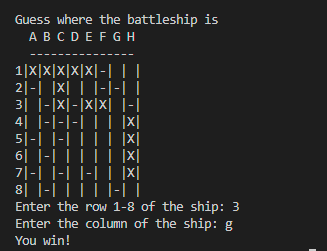
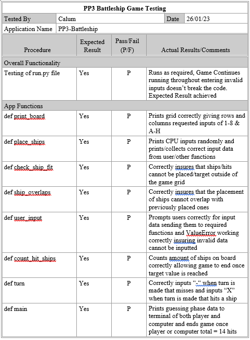
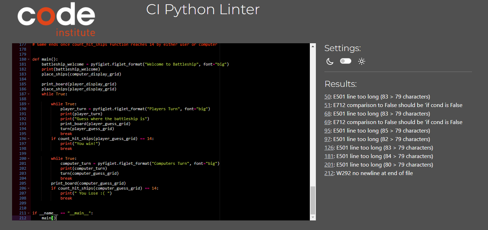
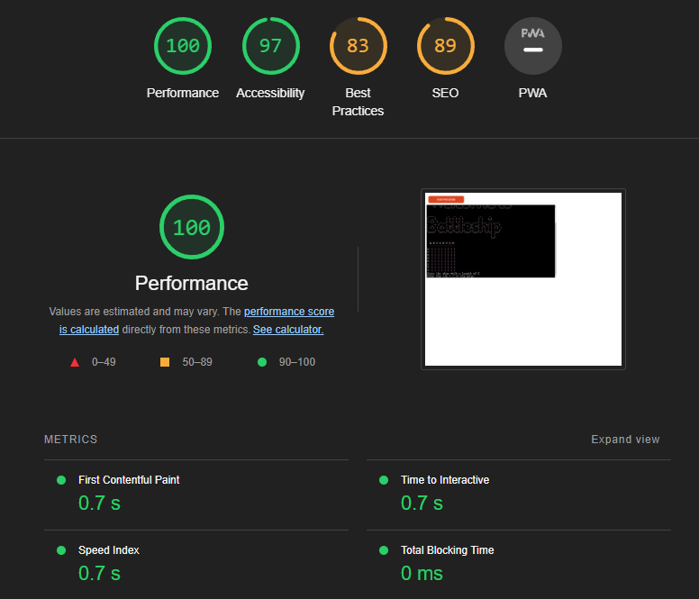

# **Battleships**

## **Portfolio 3 Project: A command-line application using Python**

## **Summary:**
Battleships is a strategy type guessing game where two players i.e player vs player or player vs ai, take turns attempting to sink each others battleships. The location of each players battleship is choosen at the start of the game and players can sink there opponents battleships by guessing where in a set grid there battleship is. Whoever is the first to destroy there opponents battleships wins. The origins of the game are debated however the first commercially available version of the game was sold in 1931 in the USA under the name of Salvo.

* A link to the deployed Git site using Heroku can be found here:
https://project3-battleship.herokuapp.com/

***

## **Table of Contents**

+ [User Experience](#user-experience)
+ [Planning](#planning)
+ [Flowchart](#flowchart)
+ [User Stories](#user-stories)
+ [Features](#features)
+ [Technologies Used](#technologies-used)
+ [Testing](#testing)
+ [Deployment](#deployment)
+ [Credits](#credits)
+ [Acknowledgements](#acknowledgements)

***

## **User Experience:**

### **Planning:**
Before coding the game I decided to map out what functions would be required for the game such as a function to create the board, a function to place the ships on the board, a function to check if the user/computer ships has been hit. I also had to plan out the associated rules that would be required with these functions some included making sure the user selected a valid row/column such as A,B,C and 1,2,3. Another rule that was also required was to ensure that the computer didn't guess the same place on the board twice, Another rule was to ensure battleships weren't placed on top of one another etc. A mapped out design of the functions method I used prior to starting the project can be found below.

### **Flowchart:**

### **User Stories:**

- User would like to play an online version of the classic Battleship game
- User would like the game to be as similar as possible to the boardgame version
- User would like to be presented with clear instructions on how to play
- User would like to play the game on his own versus a competent cpu bot

## **Features:**

### **Current Features**

- A welcome message is displayed too the user and they are prompted to enter a grid to make ship placements.

- Users can place there ships by entering a valid row target: 1-8, a valid column target A-H and finally a valid axis orientation either H "Horizontal" or V "Vertical. If users fail to input a correct column, row or orientation then the code will prompt them the valid values they can enter and will rerun this until a valid entry has been selected."

- Users will have to place a total of 4 ships each with a different length within there grid. Rules have been defined to prevent users from placing there ships outside of the grid box and to prevent them from stacking ships on top of each other.

- Once all ships have been placed the guessing stage of the game begins. Users will be once again given a blank grid they must then input targets to "fire" at. 

- Both the user and the computer take turns selecting a grid to fire at. Everytime the user makes an input for a target they will recieve a display of the computers selection above there current turn. This way users can see if they are currently beating or losing too the computer.

- Both the user and the computer will continue to guess as to where the others battleships have been placed and the game will end once either the user or computer manages to sink all of the others battleships.

### **Future Features**

For the most part the game works well and is playable; however, there is one feature that could be added in order to improve the experience for the user and make the game overall play better.

- The game itself is quite easy to win the function designed for the computer simply selects a grid at random each time it makes a turn. Compare this too a user as once they find a battleship they will immediately target the surrounding grid zones in order to fully sink it. A solution would be to come up with the logic neccessary to design a function that once it finds a target it will immediately begin to target the areas around it in order to sink that ship first before moving on. Rules would have to be made to ensure that it targets the area around it to find out which axis the ship is vertical or horizontal, another rule to ensure it stops firing once it misses along the axis, another rule to ensure it then checks the otherside of the direction it began firing in to ensure it hasn't missed anything and finally another rule to ensure that when ships are placed next to each other that the logic doesn't break. Once the computer finally knows that the ship is sunk it would continue randomly guessing once more on the grid until it finds another ship and repeats this procedure. It becomes quite clear why this feature wasn't included as it's quite a lot of logic for such a small addition but not impossible!

***

## **Technologies Used:**

## **Testing:**

- Tests where performed on each of the functions within the run.py file to ensure that all functions worked as intended:

- Python code was run through Code Institute's python validator to test for bugs. 10 bugs recorded.

- Lighthouse Test was performed on deployed heroku site for Desktop devices as website was on designed with mobile responsiveness in mind.

## **Deployment:**
*Note: this is how I deployed my own project and other features maybe required for projects that have google docs attached or are designed using different coding languages* 

1. Navigate to Heroku.com and on the daskboard, select "New" and click on "Create New App"
- Create a app name "name must be unique"
- Select your region
- Click the "Create App" button

2. Navigate to the Settings tab
- Scroll down and select the "Add Buildpack" button
- Add the buildpacks of Python and nodejs ensuring Python is placed on top of nodejs.
- Click the "Save Changes" button

3. Navigate to the Deploy tab
- Select GitHub and link your Github account to Heroku
- Search for your project repoistory by name "PP3-Battleship"
- Click the "Connect" button
- Scroll down to Deploy a Github branch and click "Deploy Branch"
- Heroku will now begin buiding the app

4. Once app is built heroku will provide a link to it which can be used by clicking "Open App"

## **Credits:**

- W3Schools
- Slack
- Knowledge Mavens: How to code Battleship in Python: https://www.youtube.com/watch?v=tF1WRCrd_HQ&ab_channel=KnowledgeMavens
- Code Institute PP3 Sample Project: Love Sandwiches

## **Acknowledgements:**

- I'd like to make a special thank you to my mentor Brian Macharia for his continued support, guidance and suggestions on how to improve my code throughout this project.